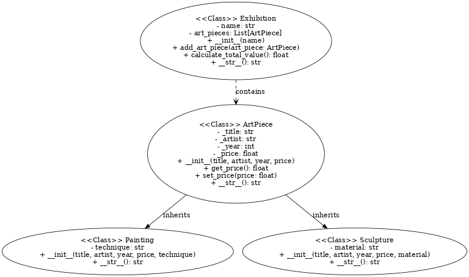

# Programowanie obiektowe w Pythonie - zadanie zaliczeniowe

Repozytorium zawiera implementację systemu zarządzania dziełami sztuki w galerii. Projekt obejmuje modelowanie hierarchii klas reprezentujących różne rodzaje dzieł sztuki, takie jak obrazy i rzeźby, oraz wystawy, które grupują te dzieła. System umożliwia dodawanie dzieł sztuki do wystaw, modyfikowanie ich atrybutów oraz obliczanie całkowitej wartości dzieł na wystawie. Jest to przykład obiektowego podejścia do projektowania w Pythonie.

## Uruchamianie kodu

Jeśli chcemy wytestować 2 statyczne scenariusze zadeklarowane w pliku `main.py`, należy uruchomic kod poprzez komendę:
`py main.py` lub `python3 main.py`

## Główne funkcjonalności:

Reprezentacja klas i logiki znajduje się w katalogi `models`.

- Klasa `ArtPiece` jako klasa bazowa, definiująca wspólne atrybuty dla dzieł sztuki.

- Klasy dziedziczące: `Painting` i `Sculpture`, które rozszerzają funkcjonalność klasy bazowej o specyficzne atrybuty i metody.

- Klasa `Exhibition`, reprezentująca wystawę, umożliwiająca zarządzanie kolekcją dzieł sztuki i obliczanie ich wartości.

- Wykorzystanie metod specjalnych, takich jak `__str__()`, w celu czytelnego wyświetlania informacji.

- Przykłady testowe, zaimplementowane w pliku wykonawczym `main`

## Testy

Testy jednostkowe zostały napisane per klasa przy uyciu biblioteki `unittest`. Znajdują się w katalogu `tests`
Aby uruchomić testy nalezy wykonać komendę:
`python3 -m unittest discover -s tests -p "*.py"`

## Schemat UML

